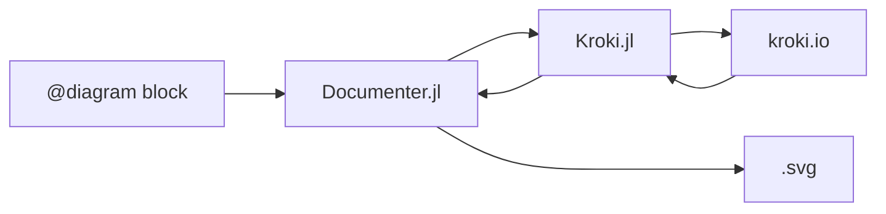

# DocumenterDiagrams.jl

Diagram features for [Documenter.jl](https://github.com/JuliaDocs/Documenter.jl), powered by [Kroki.jl](https://github.com/bauglir/Kroki.jl)

## Usage

In your `make.jl` file:
```julia
using Documenter
using DocumenterDiagrams
```

In your source `.md`:
````markdown
```@diagram mermaid
graph LR
  D["@diagram block"]
  DJL["Documenter.jl"]
  KJL["Kroki.jl"]
  K["kroki.io"]
  SVG[".svg"]
  
  D --> DJL;
  DJL --> KJL;
  KJL --> K;
  K --> KJL;
  KJL --> DJL;
  DJL ---> SVG;
```
````

will render as:


